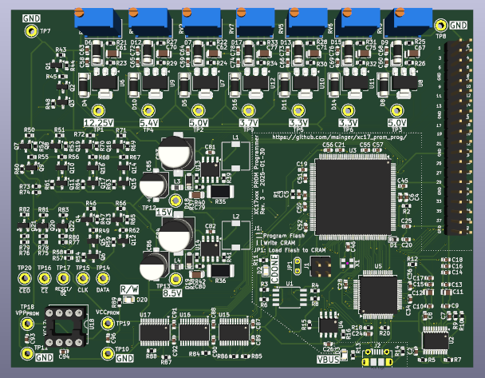

XC17xxx PROM Programmer
=======================

Tool for programming Xilinx XC17xxx families of PROM chips that are used for storing the configuration
bitstream of the Spartan FPGA.



I developed this programmer to be able to program the PROM chips used in the Wide-Boy64. The Wide-Boy64
CGB uses the XC1701L, and the [Wide-Boy64 AGB](http://iceboy.a-singer.de/doc/wide_boy.html) uses the XC17S20XL.

I originally thought that the Wide-Boy64 CGB uses the XC1701 chip (without the L at the end), because that's
how those chips are labeled on their package. After buying some of those XC1701 chips and reading out their
device ID, I realized that they actually are XC1701L chips. This makes sense by the way, since the Spartan
XC4010XL FPGA inside the Wide-Boy64 CGB has 3.3&nbsp;V IO voltage, which matches the XC1701L PROM. The XC1701
is a 5&nbsp;V device.

You can still buy the XC17S20XL chips here:
- https://de.aliexpress.com/item/1005006854844265.html
- https://www.win-source.net/products/detail/xilinx-inc/xc17s20lpc.html
- https://www.win-source.net/products/detail/xilinx-inc/xc17s20xlpd8c.html

You can still buy a very limited supply of the XC1701L chips here:
- https://www.win-source.net/products/detail/xilinx-inc/xc1701pd8c.html

The Xilinx datasheets recommend the XC17512L to be used with the Spartan XC4010XL (which is the FPGA used in
the Wide-Boy64 CGB). So, the XC17512L could be used instead of the XC1701L.


Files in this repo
------------------

| File/Folder                                 | Description                                                            |
| ------------------------------------------- | ---------------------------------------------------------------------- |
| ./pcb/xc17\_prom\_prog/                     | KiCad project.                                                         |
| ./pcb/xc17\_prom\_prog/bom.ods              | Bill of materials (BOM) needed to populate the PCB.                    |
| ./pcb/lib/                                  | KiCad symbol libraries used in KiCad project.                          |
| ./ftdi/xc17\_prom\_prog\_ftdi\_template.xml | Template for configuring the FTDI chip on the PCB.                     |
| ./hdl/                                      | Verilog project that generates the configuration for the iCE40 FPGA.   |
| ./csharp/                                   | C# project that builds the command line tool for using the programmer. |


List of supported chips
-----------------------

I designed the programmer to be able to program the chips listed in the table below. Those are the ones I was able
to find the "Programmer Qualification Specification" datasheets for. Maybe it can be modified to work for other
variants of those PROM chips when more datasheets are found.

| PROM type              | ID   | Voltage group | Word size (bit) | Density (bit) | N<sub>IDCLK</sub> | N<sub>RSTCLK</sub> | T<sub>PGM</sub> (&micro;s) | T<sub>PGM1</sub> (&micro;s) | T<sub>PRST</sub> (&micro;s) |
| :--------------------- | :--- | :-----------: | --------------: | ------------: | ----------------: | -----------------: | -------------------------: | --------------------------: | --------------------------: |
| XC1736E                | 0xED | A             |              32 |         36288 |              2056 |               2048 |                       1000 |                         N/A |                        5000 |
| XC1765E                | 0xFD | A             |              32 |         65536 |              2056 |               2048 |                       1000 |                         N/A |                        5000 |
| XC1765X aka XC1765EL   | 0xFC | B             |              32 |         65536 |              2056 |               2048 |                       1000 |                         N/A |                        5000 |
| XC17128E               | 0x8D | A             |              64 |        131072 |              4600 |               4104 |                       1000 |                         N/A |                        5000 |
| XC17128X aka XC17128EL | 0x8C | B             |              64 |        131072 |              4600 |               4104 |                       1000 |                         N/A |                        5000 |
| XC17256E               | 0xAD | A             |              64 |        262144 |              4600 |               4104 |                       1000 |                         N/A |                        5000 |
| XC17256X aka XC17256EL | 0xAC | B             |              64 |        262144 |              4600 |               4104 |                       1000 |                         N/A |                        5000 |
| XC17S05                | 0xF8 | A             |              32 |         65536 |              2056 |               2048 |                        100 |                         500 |                        5000 |
| XC17S05XL              | 0x87 | B             |              64 |        131072 |              4600 |               4104 |                        100 |                         500 |                        5000 |
| XC17S10                | 0x88 | A             |              64 |        131072 |              4600 |               4104 |                        100 |                         500 |                        5000 |
| XC17S10XL              | 0x89 | B             |              64 |        131072 |              4600 |               4104 |                        100 |                         500 |                        5000 |
| XC17S20                | 0xA8 | A             |              64 |        262144 |              4600 |               4104 |                        100 |                         500 |                        5000 |
| XC17S20XL              | 0xA9 | B             |              64 |        262144 |              4600 |               4104 |                        100 |                         500 |                        5000 |
| XC17S30                | 0xA6 | A             |              64 |        262144 |              4600 |               4104 |                        100 |                         500 |                        5000 |
| XC17S30XL              | 0xA7 | B             |              64 |        262144 |              4600 |               4104 |                        100 |                         500 |                        5000 |
| XC17S40                | 0x98 | A             |              64 |        524288 |             19791 |              16384 |                        100 |                         500 |                        5000 |
| XC17S40XL              | 0x99 | B             |              64 |        524288 |             19791 |              16384 |                        100 |                         500 |                        5000 |
| XC17S50XL              | 0xD6 | B             |              64 |       1048576 |             19791 |              16384 |                        100 |                         500 |                        5000 |
| XC17S100XL             | 0xD7 | B             |              64 |       1048576 |             19791 |              16384 |                        100 |                         500 |                        5000 |
| XC17S150XL             | 0xD9 | B             |              64 |       1048576 |             19791 |              16384 |                        100 |                         500 |                        5000 |
| XC17512L               | 0x9B | B             |              64 |        524288 |             19791 |              16384 |                        100 |                         500 |                        5000 |
| XC1701                 | 0xDA | A             |              64 |       1048576 |             19791 |              16384 |                        100 |                         500 |                        5000 |
| XC1701L                | 0xDB | B             |              64 |       1048576 |             19791 |              16384 |                        100 |                         500 |                        5000 |
| XC1702L                | 0x3B | C             |              64 |       2097152 |             65632 |              65536 |                        100 |                         200 |                         400 |
| XC1704L                | 0xBB | C             |              64 |       4194304 |             65632 |              65536 |                        100 |                         200 |                         400 |

The table also contains the properties that are different between the PROM types. I listed them here to have an overview;
makes it easier than reading through the datasheets over and over.

The ID column contains the device ID, which has the "density code" in its high nibble and the "algorithm code" in the
low nibble.

N<sub>IDCLK</sub> is the number of times the word address needs to be incremented to reach the manufacturer and device ID
page. N<sub>RSTCLK</sub> is the number of times the word address needs to be incremented to reach the page that stores
the reset polarity.

T<sub>PGM</sub> is the time for how long V<sub>PP1</sub> needs to be applied to program a word. T<sub>PGM1</sub> is the
time that V<sub>PP1</sub> needs to be applied for retries when programming failed. Not all PROM types support alternating
programming and verifying on a word for word basis, so not all of them can do retries. T<sub>PRST</sub> is the time for
how long V<sub>PP1</sub> needs to be applied to program the reset polarity.

The PROMs can be divided into three different "voltage groups", which define what voltages need to be applied to the
VCC and VPP pins:

| Group | V<sub>CC</sub>, V<sub>PP</sub>, V<sub>CCVFY</sub> | V<sub>CCP</sub>, V<sub>CCNOM</sub>, V<sub>PPNOM</sub> | V<sub>PP1</sub> | V<sub>PP2</sub> | V<sub>PPVFY</sub> |
| :---: | ------------------------------------------------: | ----------------------------------------------------: | --------------: | --------------: | ----------------: |
| A     |                                          5&nbsp;V |                                              5&nbsp;V |    12.25&nbsp;V |      5.4&nbsp;V |        5.4&nbsp;V |
| B     |                                        3.3&nbsp;V |                                              5&nbsp;V |    12.25&nbsp;V |      5.4&nbsp;V |        3.7&nbsp;V |
| C     |                                        3.3&nbsp;V |                                            3.3&nbsp;V |    12.25&nbsp;V |      3.7&nbsp;V |        3.7&nbsp;V |


PCB Specification
-----------------

I would recommend using the ZIP file from the latest github release, which contains the Gerber and drill files. Use these
parameters for ordering the PCB:

| Parameter         | Value                      |
| ----------------- | -------------------------- |
| Size              | 123&nbsp;x&nbsp;95&nbsp;mm |
| Layers            | 2                          |
| Min hole size     | 0.3&nbsp;mm                |
| Min track/spacing | 6/6&nbsp;mil               |
| Surface finish    | ENIG                       |

The PCB doesn't contain any vias in pads.


PCB population
--------------

There are two ways to populate the PCB:
* Fully populated, including FPGA and FTDI.
  - Programmer doesn't require any additional hardware.
* Partially populated, leaving out the parts inside the dotted area.
  - Programmer needs to be plugged into an
    [iCE40-HX8K Breakout Board](https://www.latticesemi.com/Products/DevelopmentBoardsAndKits/iCE40HX8KBreakoutBoard.aspx).
  - The HX8K Breakout Board needs to be connected via USB to the PC.
  - The programmer PCB needs power over the USB port, but no data connection.

There are some parts that aren't easy to solder by hand, so if you want to save yourself some trouble, you can get
an HX8K Breakout Board. You don't need a cable to connect the two. Just solder a pin header (J3) at the bottom side
of the programmer PCB, you can plug it directly into the already soldered pin sockets of the HX8K Breakout Board (J2).

IF YOU FULLY POPULATED THE PCB, DO _**NOT**_ CONNECT IT TO AN HX8K BREAKOUT BOARD.

The [BOM](pcb/xc17_prom_prog/bom.ods) contains the parts required to fully populate the PCB. If you plan to only
partially populate it, make sure you don't order the non-required expensive parts like FPGA, FTDI and the LT3030
regulator.


FTDI configuration
------------------

The FTDI chip needs to be configured correctly, otherwise the FPGA can't be programmed. The FTDI configuration is held
in the small EEPROM chip (U4). It is programmed via USB using the FT\_PROG utility that you can download from the
[FTDI website](https://ftdichip.com/utilities/). FT\_PROG requires Windows. It also works from inside a Windows 10 VM
running on VirtualBox.

Program the [template file](ftdi/xc17_prom_prog_ftdi_template.xml) from this repository into the EEPROM. Make sure the
EEPROM is erased first.


Build FPGA bitstream
--------------------

To build the bitstream for the FPGA, you need the following tools:
* [yosys](https://github.com/YosysHQ/yosys)
* [nextpnr](https://github.com/YosysHQ/nextpnr)
* [icestorm](https://github.com/YosysHQ/icestorm)
* Plus all the standard development tools like gnumake, autoconf, automake, m4

On Fedora, you can use the following command line to install everything:

```
dnf install yosys nextpnr icestorm make autoconf automake m4
```

Inside the `hdl` directory of the repository, run the following commands to build the bitstream for a fully populated
PCB:

```
autoreconf -i
./configure --enable-board=xc17_prom_prog
make
```

If you've partially populated the PCB and connected it to the HX8K Breakout Board, then use the following commands
instead:

```
autoreconf -i
./configure --enable-board=hx8k_brk
make
```


Program FPGA bitstream into Flash
---------------------------------

The FPGA bitstream needs to be programmed into the flash chip on the PCB or HX8K Breakout Board via USB.

On a fully populated PCB, make sure to put the J1 jumpers into the "Program Flash" configuration, which is
horizontal, like it is indicated on the PCB silk print. JP1 has to be bridged as well. If you want to flash the HX8K
Breakout Board, read the documentation for that. Once the jumpers are placed correctly, you don't have to fiddle
with them anymore. Other jumper configurations are only for development, when you want to test a new FPGA
configuration without burning it into the flash. So you could also bridge the jumpers directly with solder or small
wires on the PCB.

If you've built the FPGA bitstream yourself, you can run the following command inside the `hdl` directory to program
the bitstream:

```
make prog
```

If you want to program a prebuilt release that you've downloaded from github, use the following command:

```
iceprog xc17_prom_prog.bin
```

I haven't tried it, but it should also be possible to use the
[Lattice iCEcube2 Software](https://www.latticesemi.com/en/Products/DesignSoftwareAndIP/FPGAandLDS/iCEcube2)
to program either the `asc` file or the `bin` file.

The green LED D2 (labeled CDONE) indicates that the FPGA has successfully loaded the configuration from the
flash into its configuration RAM. So, on a fully populated PCB, this LED should switch on after the flash was
programmed correctly, every time you power up the board (with the correct jumper configuration described above).
The HX8K Breakout Board also has such an LED (D10) near the jumpers.


Build the command line tool
---------------------------

For building the C# command line tool on Linux, you need the Mono framework and the standard tools gnumake, autoconf,
automake and m4.

For building it on Windows, you need the .NET Framework and some POSIX-like environment for building: Either Cygwin or
Msys2. Gnumake, autoconf, automake and m4 need to be installed in that environment. The C# compiler executable (csc.exe)
must also be callable in your build environment. Make sure it is in `$PATH`.

Run the following commands inside the `csharp` directory of the repository to build the command line tool:

```
autoreconf -i
./configure
make
```

If you want, you can install it with `make install`.


Calibration and testing of PCB
------------------------------

After populating the PCB you have to calibrate all the voltages using the trim potentiometers at the top. Just
hold your voltage meter at the test points near the potentiometers. The target voltage that each test point should
have is labeled on the silk screen print.

If the LDOs are not providing high enough voltages, check if the step-up converters provide roughly 15&nbsp;V and
8.5&nbsp;V at test points TP12 and TP13. The 15&nbsp;V is used by the first LDO (U6) to generate the 12.25&nbsp;V.
The other six LDOs use the 8.5&nbsp;V to generate their lower voltages. In case you are wondering, the reason why
there are two 3.3&nbsp;V LDOs and two 5&nbsp;V LDOs is this: One of each is there for providing the VCC voltage for
the PROM, the other one (of each) is there for providing the VPP voltage. We can't use the same LDOs for VCC and
VPP, because VPP will be switched to 12.25&nbsp;V for issuing the programming pulses. There is a short moment during
switching where the 12.25&nbsp;V and the lower voltage (3.3&nbsp;V or 5&nbsp;V) will both be connected to VPP at the
same time. At this moment, the 12.25&nbsp;V will back flow to the other LDO. If we'd use the same LDO, then the
12.25&nbsp;V would also reach the VCC pin of the PROM, which is not good. VCC needs to be constant at all time, and
it can't handle 12&nbsp;V. Only VPP can switch around.

Before trying to read or program an actual PROM chip, you first should do some tests to make sure the PCB is
working correctly.

Connect the PCB via USB and run the command line tool with the following options:

```
xc17_prom_prog.exe COMMPORT --test-echo
```

Replace *`COMMPORT`* with the correct serial port. On Windows this would be `COM2:` or something. On Linux it is
something like `/dev/ttyUSB1`. The FTDI chip has two serial ports. Usually, the first one is the one that is used
for programming the flash chip (U1) that holds the FPGA bitstream. The second port is the one we need most likely,
so try this one first. Of course, on Linux you have to call the command with `mono`, like this:

```
mono xc17_prom_prog.exe /dev/ttyUSB1 --test-echo
```

`--test-echo` just tests the serial communication and the BRAM inside the FPGA.

Next, we can test the voltage switching MOSFETs:

```
xc17_prom_prog.exe COMMPORT --test-voltage VOLTAGE
```

Again, replace *`COMMPORT`* with the actual port. For *`VOLTAGE`* insert one of the following:

 - `vcc-3v3`
 - `vcc-5v`
 - `vpp-3v3`
 - `vpp-3v7`
 - `vpp-5v`
 - `vpp-5v4`
 - `vpp-12v25`
 - `off`

For example, `vcc-3v3` will switch 3.3&nbsp;V onto the VCC pin of the PROM. (Don't actually put a PROM chip
into the socket when testing the voltages, please!) You can measure that with your voltage meter at test point
TP19. `vpp-5v4` will switch 5.4&nbsp;V onto the VPP pin at test point TP18, and so on. This test option only
enables one single voltage at a time, so don't worry, you can't make short circuits. `off` switches all MOSFETs
off, as the name implies. The red LED (D20) signals whenever at least one of the two pins (VCC, VPP) is powered
to indicate that you shouldn't insert or remove the chip right now.

There are actually three other options that can be inserted for *`VOLTAGE`* (`vcc-gnd`, `vpp-gnd` and
`vpp-gnd-weak`), but you can't measure anything there, because they are pulling the respective pin to ground.

If the voltage switching works, we should test if the 12.25&nbsp;V pulse looks okay using an oscilloscope. Hook
up one probe to test point TP18 (VPP<sub>PROM</sub>) and one to TP19 (VCC<sub>PROM</sub>). Configure the trigger
to around ~8&nbsp;V on the probe connected to VPP<sub>PROM</sub>, so we can trigger when VPP raises from
5&nbsp;V to 12.25&nbsp;V. Then run this command:

```
xc17_prom_prog.exe COMMPORT --prom xc17s20xl --detect
```

`--prom xc17s20xl` configures the programmer to use the voltages required by the XC17S20XL PROM chip (which is
used in the Wide-Boy64 AGB). This PROM chip is a 3.3&nbsp;V device, but it needs to be powered with 5&nbsp;V
to enter "programming mode". `--detect` makes the programmer just read the manufacturer and device IDs of the
PROM chip, without reading or programming anything else. For reading the IDs, the PROM has to enter "programming
mode", which sounds counterintuitive, but that's how it's done. So, the programmer will switch VCC and VPP to
5&nbsp;V. Then shortly after switching them to 5&nbsp;V, it will issue a short pulse of 12.25&nbsp;V on VPP.

On the oscilloscope we want to check the following things:

 * There should be no over and/or under shooting when the voltage on VPP raises from 5&nbsp;V to 12.25&nbsp;V
   and falls back down to 5&nbsp;V.
 * The raising and falling of the voltage on VPP shouldn't take much longer than 5&nbsp;&micro;s.
 * According to the datasheets, VCC must stay stable within &plusmn;50&nbsp;mV. I wasn't able to comply with
   that. My VCC was always swinging a bit more when the 12.25&nbsp;V ramps up on VPP. I couldn't figure out
   why this happens and how to fix it. Just make sure VCC looks reasonable, programming the PROM will work
   anyway.

If VPP takes too long to fall down to 5&nbsp;V, then the resistor R82 is probably too big and you should try
a smaller one. If VPP drops below 5&nbsp;V or if it is unstable or oscillating for some microseconds after
falling down, then resistor R82 could be too small. Try a bigger one in that case.

Next, we want to check the programming pulse. It is basically the same, but it will fall down to 5.4&nbsp;V
instead of 5&nbsp;V, and it stays at 12.25&nbsp;V for a much longer time. To make the programmer generate
programming pulses, you can run the following command without a PROM chip inserted into the socket:

```
xc17_prom_prog.exe COMMPORT --prom xc17s20xl --force-program TESTFILE
```

This will run the programming algorithm without stopping on errors, like not detecting a PROM. It will try
to program the file *`TESTFILE`*. You can select any file for testing, it doesn't matter, we don't want to
look at the data. It must not contain only 0xFF though, because words that only consist of 1's will be
skipped during programming and will not cause a pulse, because that is the blank state of the chip. So on
Linux you could use `/dev/zero` or `/dev/random` for testing, but not `/dev/null`, because that will
immediately signal the end of file and then only 0xFF would be assumed for programming.

To trigger on the programming pulses with an oscilloscope can be tricky, because the first two or three
pulses will be the same that we have already tested, because the programmer needs to bring the chip into
"programming mode" first. We want to measure any of the later pulses. Maybe your oscilloscope supports
defining a count, so that you can let it trigger at the fourth or fifth rising edge. If not, it's okay. I
just pressed enter on the command line, and then half a second later I hit the "SINGLE" button on my
oscilloscope to arm it, so it triggers on a later pulse. It may take some tries to get the timing right.

Check for the same criteria as before. If you want, you can repeat those tests with `--prom xc1702l`. This
particular PROM type uses 3.3&nbsp;V in programming mode, which requires a slightly longer timing to let
VPP drop from 12.25&nbsp;V to 3.3&nbsp;V or 3.7&nbsp;V. Testing for this PROM type isn't necessary if you
just want to use the programmer to program PROMs for Wide-Boys. Both of the Wide-Boy types are using PROMs
that run on 5&nbsp;V in programming mode.


Command line options
--------------------

| Option                                                        | Description                                                                                                                                                                                                                                                                                                                                                                                                                                                            |
| ------------------------------------------------------------- | ---------------------------------------------------------------------------------------------------------------------------------------------------------------------------------------------------------------------------------------------------------------------------------------------------------------------------------------------------------------------------------------------------------------------------------------------------------------------- |
| <code>&#x2011;&#x2011;help</code>                             | Prints summary of all options.                                                                                                                                                                                                                                                                                                                                                                                                                                         |
| <code>&#x2011;&#x2011;prom&nbsp;PROM</code>                   | Configures the programmer to handle the specific PROM chip. Replace `PROM` with the type name of any of the supported PROM chips listed in the PROM type table above, like `xc17s20xl` for example. This option must be used in combination with any of the other options that specify the operation.                                                                                                                                                                  |
| <code>&#x2011;&#x2011;test&#x2011;echo</code>                 | Tests communication and BRAM buffers on programmer.                                                                                                                                                                                                                                                                                                                                                                                                                    |
| <code>&#x2011;&#x2011;test&#x2011;voltage&nbsp;VOLTAGE</code> | Don't use this option when a PROM is inserted! Switch on a single supply `VOLTAGE` and switch off all others for testing. `VOLTAGE` can be one of <code>vcc&#x2011;gnd</code>, <code>vcc&#x2011;3v3</code>, <code>vcc&#x2011;5v</code>, <code>vpp&#x2011;gnd</code>, <code>vpp&#x2011;gnd&#x2011;weak</code>, <code>vpp&#x2011;3v3</code>, <code>vpp&#x2011;3v7</code>, <code>vpp&#x2011;5v</code>, <code>vpp&#x2011;5v4</code>, <code>vpp&#x2011;12v25</code>, `off`. |
| <code>&#x2011;&#x2011;detect</code>                           | Detect presence of the PROM chip by reading manufacturer and device ID. The <code>&#x2011;&#x2011;prom</code> option must be used to specify the PROM type.                                                                                                                                                                                                                                                                                                            |
| <code>&#x2011;&#x2011;blank</code>                            | Performs blank check on a PROM chip. Returns 0 if the chip is blank, otherwise 1. Whether the reset polarity of the chip was programmed does not affect the result. The <code>&#x2011;&#x2011;prom</code> option must be used to specify the PROM type.                                                                                                                                                                                                                |
| <code>&#x2011;&#x2011;read&#x2011;reset</code>                | Reads reset polarity of the chip. Returns 0 if the reset polarity was programmed to be active low; otherwise, if it is not programmed (active high), it returns 1. The <code>&#x2011;&#x2011;prom</code> option must be used to specify the PROM type.                                                                                                                                                                                                                 |
| <code>&#x2011;&#x2011;read&nbsp;OUTFILE</code>                | Reads the content of the chip and writes it into `OUTFILE`. The <code>&#x2011;&#x2011;prom</code> option must be used to specify the PROM type.                                                                                                                                                                                                                                                                                                                        |
| <code>&#x2011;&#x2011;margin&#x2011;read&nbsp;OUTFILE</code>  | Reads the content of the chip and writes it into `OUTFILE`. Applies a voltage margin of 0.4&nbsp;V between VCC and VPP during the read operation. This margin makes it more likely to misread bits that haven't been charged sufficiently during programming. So you can use this read option when you want to challenge the "health" or "quality" of the programmed bits. The <code>&#x2011;&#x2011;prom</code> option must be used to specify the PROM type.         |
| <code>&#x2011;&#x2011;verify&nbsp;INFILE</code>               | Verifies that the content of the chip matches the content of `INFILE`. The <code>&#x2011;&#x2011;prom</code> option must be used to specify the PROM type.                                                                                                                                                                                                                                                                                                             |
| <code>&#x2011;&#x2011;margin&#x2011;verify&nbsp;INFILE</code> | Verifies that the content of the chip matches the content of `INFILE`. Same as for <code>&#x2011;&#x2011;margin&#x2011;read</code> it applies a voltage margin of 0.4&nbsp;V between VCC and VPP. The <code>&#x2011;&#x2011;prom</code> option must be used to specify the PROM type.                                                                                                                                                                                  |
| <code>&#x2011;&#x2011;program&nbsp;INFILE</code>              | Programs the content of `INFILE` onto the PROM chip. For chips that support a word by word verification during programming, the operation will abort as soon as a word was detected to be written incorrectly. The <code>&#x2011;&#x2011;prom</code> option must be used to specify the PROM type.                                                                                                                                                                     |
| <code>&#x2011;&#x2011;force&#x2011;program&nbsp;INFILE</code> | Programs the content of `INFILE` onto the PROM chip. This option should be used for measuring the programming pulse with an oscilloscope. It skips the PROM chip detection and ignores verification errors, so it will run through even if no chip is inserted into the socket. The <code>&#x2011;&#x2011;prom</code> option must be used to specify the PROM type.                                                                                                    |
| <code>&#x2011;&#x2011;program&#x2011;reset</code>             | Programs the reset polarity of the PROM chip to be active low. If not programmed, the reset polarity is active high. The <code>&#x2011;&#x2011;prom</code> option must be used to specify the PROM type.                                                                                                                                                                                                                                                               |


Reading a PROM chip
-------------------

To read the content of an already programmed PROM chip, use the following command line:

```
xc17_prom_prog.exe COMMPORT --prom PROMTYPE --read OUTFILE
```

As an example, if you want to read the XC17S20XL PROM chip from a Wide-Boy64 AGB on Linux,
your command line will look something like this:

```
mono xc17_prom_prog.exe /dev/ttyUSB1 --prom xc17s20xl --read wideboy64agb_prom.bin
```


Programming a PROM chip
-----------------------

To program an image file onto a blank PROM chip, perform the following actions:

First, check if the chip is really blank:

```
xc17_prom_prog.exe COMMPORT --prom PROMTYPE --blank
```

A message will be displayed if the chip isn't blank. The reset polarity of the chip is
always printed before each operation. So you can also check that the reset is not programmed
already.

Then we can program the image file:

```
xc17_prom_prog.exe COMMPORT --prom PROMTYPE --program INFILE
```

After programming the data, you have to decide if you want to program the reset polarity to be active low.
Both Wide-Boy variants (CGB and AGB) require an active low reset of the chip. So if you want to program
the chip for use in a Wide-Boy, then you have to program the reset polarity:

```
xc17_prom_prog.exe COMMPORT --prom PROMTYPE --program-reset
```

Remember, before performing any operation, the programming tool always prints the current reset polarity.
So, the "program reset" operation will report the current reset polarity as "not programmed" (active high).
If programming the reset polarity fails, there will be an error message.

Finally, we can verify if the programming was successful:

```
xc17_prom_prog.exe COMMPORT --prom PROMTYPE --margin-verify INFILE
```

This should now also report the reset polarity as "programmed" (active low), if you have performed that
step before.

